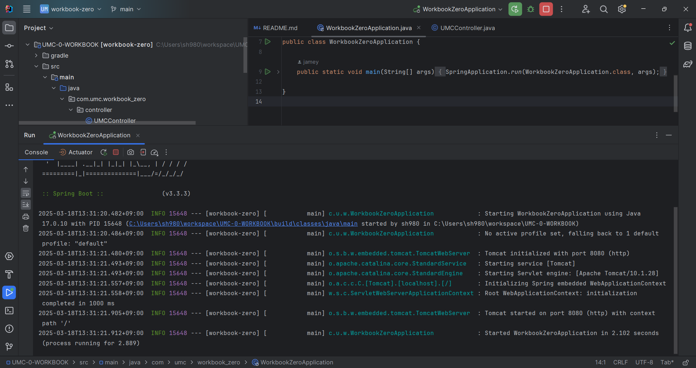
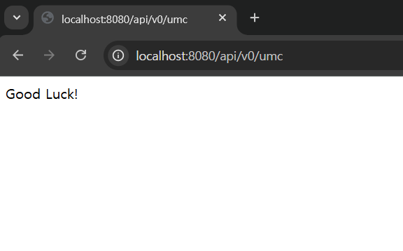

## 🎯핵심 키워드

---

<aside>
💡 주요 내용들에 대해 조사해보고, 자신만의 생각을 통해 정리해보세요!
레퍼런스를 참고하여 정의, 속성, 장단점 등을 적어주셔도 됩니다.
조사는 공식 홈페이지 **Best**, 블로그(최신 날짜) **Not Bad**

</aside>

- IP

  컴퓨터, 스마트폰, 서버 등 네트워크에 연결된 모든 장치에 부여되는 고유한 주소.

  IPv4 와 IPv6가 있고, IPv4가 고갈될 위기에 처하자 나온것이 IPv6. (이 두개는 비트수에 따라 다름.)

  공인 IP / 사설 IP / 고정 IP / 유동 IP 등이 있고, 이 중 사설IP가 가장 중요.

  `공인IP`까진 공유기에 할당을 해주고, 그 네트워크 안에서만 사용되는 IP가 `사설 IP` 임. (이것이 나온 이유가, IP가 고갈될 것을 방지하여 나온 것. 같은 번호여도 앞의 정보가 다르면, 다른 IP로 적용 시킬 수 있기에.)

  이를 묶은 것이  `사설망`

  ex) 2학년 1반 1번 , 3학년 2반 1번 → 같은 1번이어도 반과 학년이 다르듯. 같은 반 안에서 나눈다고 생각하면 이해하기 쉬움.

  같은 사설망 안에서는 IP만 있으면 자유롭게 통신이 가능함. 하지만, 다른 네트워크와 통신하려면 반드시 `게이트웨이`를 거쳐야함.

- PORT

  한 컴퓨터 내에서 프로그램이 여러개 켜져있을 때 그 프로그램을 구분하는 번호.

  ex) [localhost:8080](http://localhost:8080) 과 [localhost:3](http://localhost:3030)000
  서버와 리액트 서버의 포트가 달라서, 프로세스를 구분할 수 있었던 것!

- CIDR

  A.B.C.D/N .. 이게 CIDR (사이더) 표기법.

  원래는, IP주소를 크게 세가지 클래스인 A클래스 (`10.0.0.0`) , B클래스 (`172.16.0.0`), C클래스 (`192.168.1.0`) 등으로 원래 사용했음. 즉, C클래스는 256가지의 `192.168.1.0`부터 `192.168.1.255`까지 **256개**를 쓸 수 있었음.

  하지만, 이런식으로 256개의 IP 주소가 있으면 다 쓰이는 경우도 분명 있겠지만, 다 안쓰이고 IP 주소가 낭비되는 경우가 있음. 이걸 해결하고, IP 주소를 유연하게 나누기위해 나온것이 CIDR.

  `192.168.1.0/24` -> 이것이 기본 C클래스 IP의 디폴트 값.

  `/24` = 256개 (기본 C클래스)
  `/25` = 128개
  … 이런식으로  `/N`의 숫자가 커질수록 IP 주소가 줄어 듦. (반대로 숫자가 적어지면 IP주소가 커짐.)

  | CIDR 표기법 | 서브넷 마스크 | 호스트 개수 |
      | --- | --- | --- |
  | `192.168.1.0/24` | 255.255.255.0 | 256개 |
  | `192.168.1.0/25` | 255.255.255.128 | 128개 |
  | `192.168.1.0/26` | 255.255.255.192 | 64개 |
  | `192.168.1.0/27` | 255.255.255.224 | 32개 |
  | `192.168.1.0/28` | 255.255.255.240 | 16개 |
- TCP와 UDP 차이

  TCP 란?

  Transfer Layer에서 사용이 되며, 3가지 특징이 적용되는 프로토콜.

    1. 3 way-handshake ( 송신자와 수신자를 먼저 연결한 뒤 데이터를 보냄. )
    2. 데이터 전달 보증 ( `패킷 (서로 전달하는 데이터)` 을 받았음을 알림)
    3. 순서보장 (sequence number를 통해 순서를 보장하고, 그 순서가 틀리면 데이터 다시 요청.)

  → 데이터를 `확실하게` 전달하는 것에 초점을 맞춤.

  ex) 파일 전송, 이메일

  UDP 란?

  TCP의 주요 특징이 적용되지 않은 프로토콜 .

  연결, 데이터 전달보증, 순서보장의 특징이 적용되지 않아서 빠르게 통신할 수 있음.

  → 데이터를 `빠르게` 전달하는 것에 초점을 맞춤.

  ex) 실시간 스트리밍, 게임.

- Web Server와 WAS의 차이
    1. WS와 WAS의 자원관리를 할 때 정적리소스의 개수에 따라서 WS의 수를 늘리거나 줄이는 방법이 있다는 것을 처음 깨달음.
    2. WAS가 정적리소스도 처리하기에 단순하게 WAS로만 모든것을 처리하면 될 줄 알았는데, WAS가 비싸기도 하고, 이러한 방식대로 하게 되면 WAS가 너무 많은 것을 처리하게 되어 서버에서 과부하가 발생할 수 있다는 것을 알게 됨.
       이렇게 WAS에서 장애가 발생하면, 정적컨텐츠로 제공되어야 하는 오류화면도 제공할 수 없게 됨. 따라서 WS와 WAS의 적당한 조화가 필요함.

## 📢 학습 후기

---

- 이번 주차 워크북을 해결해보면서 어땠는지 회고해봅시다.
- 핵심 키워드에 대해 완벽하게 이해했는지? 혹시 이해가 안 되는 부분은 뭐였는지?

<aside>
💡

</aside>

## ⚠️ 스터디 진행 방법

---

1. 스터디를 진행하기 전, 워크북 내용들을 모두 채우고 스터디에서는 서로 모르는 내용들을 공유해주세요.
2. 미션은 워크북 내용들을 모두 완료하고 나서 스터디 전/후로 진행해보세요.
3. 다음주 스터디를 진행하기 전, 지난주 미션을 서로 공유해서 상호 피드백을 진행하시면 됩니다.

## ✅ 실습 체크리스트

---

## ☑️ 실습 인증

---

## 🔥 미션

---

1. 너디너리 홈페이지 접속하는 과정 적어보기 (소켓프로그래밍과 같은 개념 없이 TCP, IP, PORT 등의 개념 등 오늘 배운 내용으로 간단하게 적어주세요)
2. 깃허브 clone 받아서 실행하고 나온 페이지 스크린 샷 찍기

## 💪 미션 기록

---

<aside>
🍀 미션 기록의 경우, 아래 미션 기록 토글 속에 작성하시거나, 페이지를 새로 생성하여 해당 페이지에 기록하여도 좋습니다!

하지만, 결과물만 올리는 것이 아닌, **중간 과정 모두 기록하셔야 한다는 점!** 잊지 말아주세요.

</aside>

- **미션 기록**
    1. 너디너리 홈페이지 url 입력 후 엔터를 치면!
    2. https://neordinary.co.kr:443  이 주소를 이제 컴퓨터가 해석할 수 있도록 DNS 서버라는 곳에서 도메인에 연결된 IP 주소 반환.

  예: `neordinary.co.kr → 192.168.100.50`

    - DNS란?
        - 웹사이트 주소(`www.naver.com`)는 사람이 이해하기 쉽지만, 컴퓨터는 **IP 주소(`223.130.195.200`)**만 이해할 수 있음.
        - 그래서 **DNS 서버**에서 해당 도메인에 연결된 IP 주소를 찾아 반환함.

    1. TCP를 이용하여 서버와 클라이언트가 서로 연결할 준비를 함. (`3-Way Handshake`)
        
        3-1. 클라이언트 → 서버 (SYN 패킷 전송)   “ 나 연결할래 ”
        
        3-2. 서버 → 클라이언트 (SYN + ACK 패킷 응답)   “ ㅇㅋ 연결하셈 ”
        
        3-3 . 클라 → 서버 (ACK 패킷 전송)  “ 데이터 주고받기 ”
        
    2. HTTP 요청 (클라 → 서버)
    3. HTTP 응답 (서버 → 클라)
    4. TCP의  `순서보장`특징을 통해 패킷의 순서가 올바르게 전달되게 함. 
    5. TCP의 `데이터 전달보장` 특징을 통해 패킷이 올바르게 전달됐는지 확인. 
    
    (6번과 7번은 HTTP 요청 및 응답하는 과정에서 계속 수행되는 과정임.)
    
    1. 화면에 렌더링 되면서 끝!

## ⚡ 트러블 슈팅

---

<aside>
💡 실습하면서 생긴 문제들에 대해서, **이슈 - 문제 - 해결** 순서로 작성해주세요.

</aside>

<aside>
💡 스스로 해결하기 어렵다면? 스터디원들에게 도움을 요청하거나 **너디너리의 지식IN 채널에 질문**해보세요!

</aside>

- ⚡이슈 작성 예시 (이슈가 생기면 아래를 복사해서 No.1, No.2, No3 … 으로 작성해서 트러블 슈팅을 꼭 해보세요!)

  **`이슈`**

  👉 앱 실행 중에 노래 다음 버튼을 누르니까 앱이 종료되었다.

  **`문제`**

  👉 노래클래스의 데이터리스트의 Size를 넘어서 NullPointException이 발생하여 앱이 종료된 것이었다.

  **`해결`**

  👉  노래 다음 버튼을 눌렀을 때 데이터리스트의 Size를 검사해 Size보다 넘어가려고 하면 다음으로 넘어가는 메서드를 실행시키지 않고, 첫 노래로 돌아가게끔 해결

  **`참고레퍼런스`**

    - 링크
- ⚡이슈 No.1

  **`이슈`**

  👉 [트러블이 생긴 상태 작성]

  **`문제`**

  👉 [어떤 이유로 해당 이슈가 일어났는지 작성]

  **`해결`**

  👉  [해결 방법 작성]

  **`참고레퍼런스`**

    - [문제 해결 시 참고한 링크]