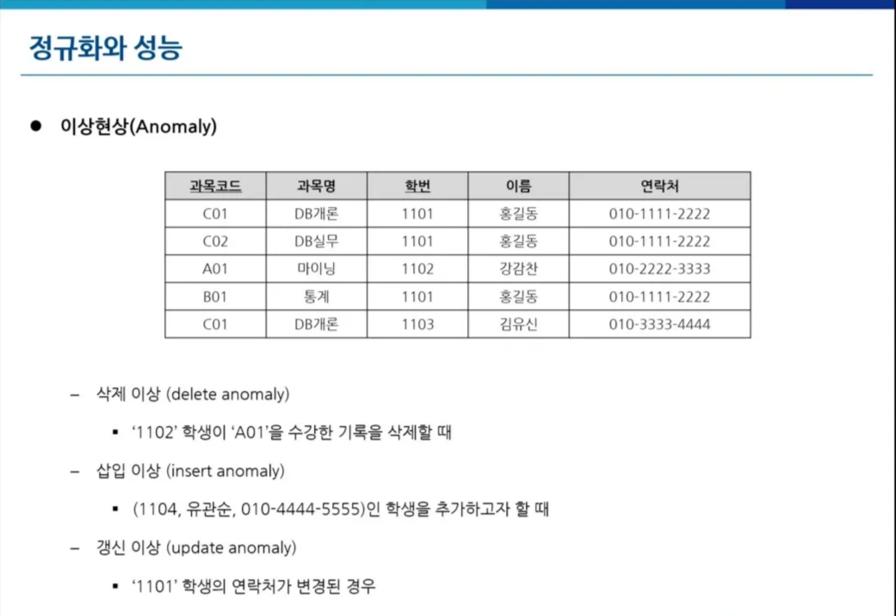
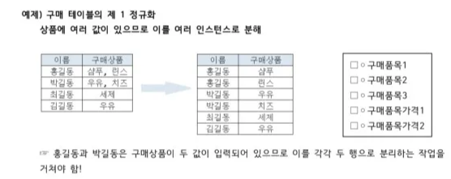
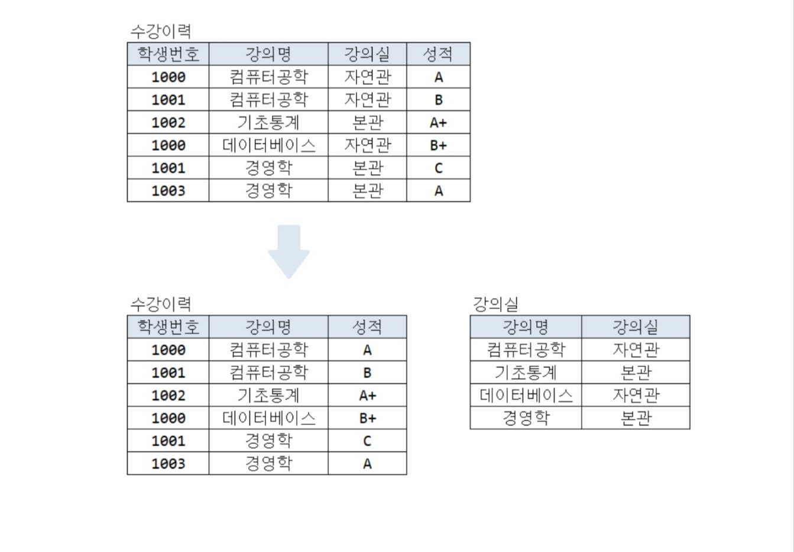
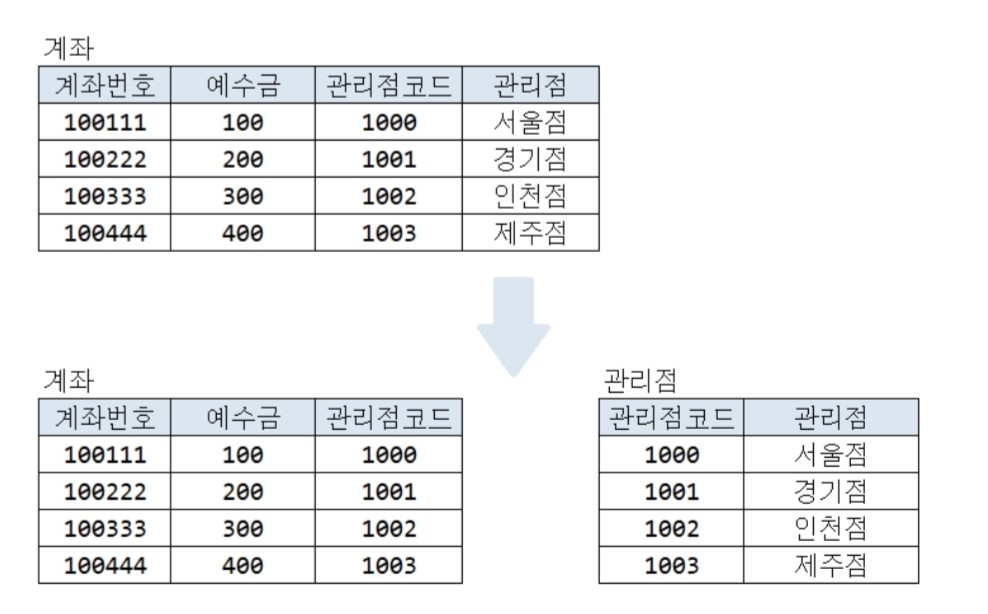
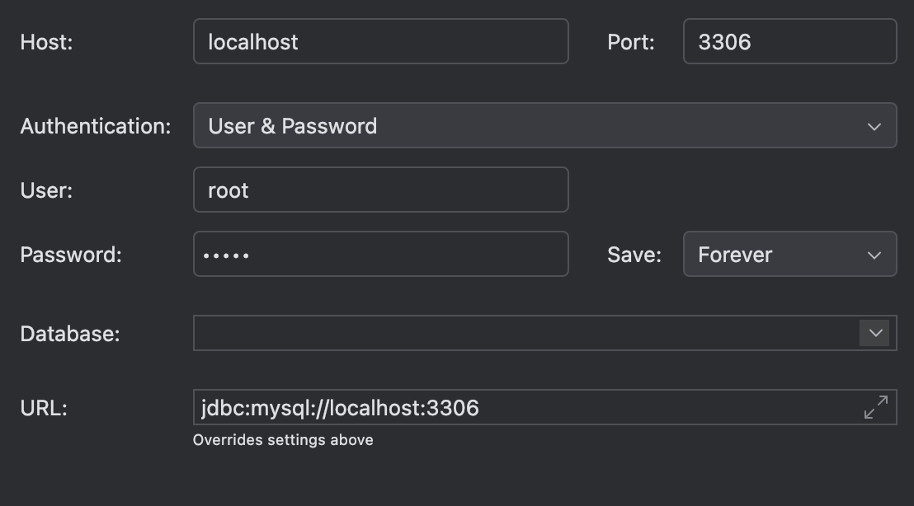
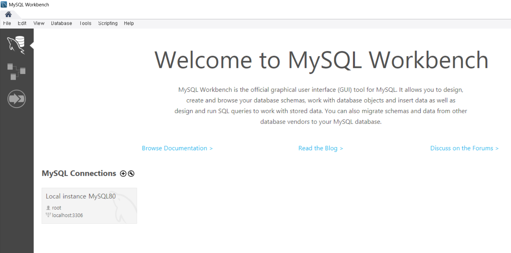

# Chapter 1. Database 설계

# 🎯 핵심 키워드

---

<aside>
💡 주요 내용들에 대해 조사해보고, 자신만의 생각을 통해 정리해보세요!
레퍼런스를 참고하여 정의, 속성, 장단점 등을 적어주셔도 됩니다.
조사는 공식 홈페이지 **Best**, 블로그(최신 날짜) **Not Bad**

</aside>

- 외래키
    
    `외래키(Foreign Key, FK)`는 한 테이블의 컬럼이 다른 테이블의 `기본키(Primary Key, PK)`와 연결되어 있는 것
    
    ex) 학생 테이블의 학과 번호 (학과 테이블의 PK)
    
    `참조 무결성 제약`(외래키는 Null 이거나, Null이 아니라면 다른 테이블에 실제로 존재하는 값으로 구성되어야 함.) 을 지켜야함
    
- 기본키
    
    테이블의 각 행을 유일하게 식별하는 컬럼 또는 컬럼들의 조합, NULL 값이 들어갈 수 없음 
    
    ( Unique & NOT NULL ) → 개체 무결성 제약
    
    ex) 학번 
    
- ER 다이어그램
    
    ER 다이어그램은 데이터베이스 설계를 시각적으로 표현한 다이어그램
    
    테이블 간의 관계를 쉽게 이해할 수 있도록 나타낸 그림.
    
- 복합 키
    
    두 개 이상의 컬럼을 조합하여 기본키로 설정한 것
    
    ex) 학번 + 이름 
    
- 연관관계
    
    외래키를 이용해서 테이블 간의 연관관계를 설정!
    
    연관관계의 종류로는, 
    
    1. **일대일 관계 (One - to - One)**
    
    **: 한 쪽 테이블이 다른 쪽의 기본키를 외래키로 가짐.**
    
    1. **일대다 관계 (One - to - Many)**
    
    **: 다(N) 측 테이블이 일(1) 측 테이블의 기본키를 외래키로 가짐.**
    
      **3. 다대다 관계 (Many - to - Many)**
    
    **: 중간테이블을 만들어서 다대다 관계를 두 개의 1:N 관계로 변환.**
    
- 정규화
    
    `삭제이상`, `삽입이상`, `갱신이상`을 방지하기 위해 하는 것이 `정규화`이다.
    
    - `이상현상(삭제,삽입,갱신)`이란?

      
        
        1. 삭제이상이 발생하는 이유:  이 경우에선 A01이라는 과목코드를 가진 과목 자체가 DB에서 사라지게 됨.
        2. 삽입이상이 발생하는 이유 : PK인 과목코드가 없어서 삽입이상 발생
        3. 갱신이상이 발생하는 이유 : ‘1101’학생의 데이터 여러군데에서 갱신을 해야함.
    
    `정규화`에는 `1차 정규화`, `2차 정규화`, `3차 정규화` 등등이 있음.
    
    **제 1 정규화**
    
    - 테이블의 컬럼이 원자성을 갖도록 테이블을 분해하는 단계
    - 즉, 하나의 행과 컬럼의 값이 반드시 한 값만 입력되도록 행을 분리하는 단계
    
    ex)

  
    
    **제 2 정규화**
    
    - 제 1 정규화를 진행한 테이블에 대해 `완전 함수 종속` 을 만들도록 테이블을 분해
    - `완전 함수 종속` 이란, 기본키를 구성하는 모든 컬럼의 값이 다른 컬럼을 결정짓는 상태
    - 즉, PK가 2개 이상일 때 발생하며, PK하나 만으로 다른 컬럼을 결정할 수 있을 때 분리하는 것이 2차 정규화!
    
    ex)
  
    
    → 학생번호와 강의명이 (PK)인 테이블
    
    → 근데, 강의명에 따라서 강의실이 결정이 되므로 이걸 강의실 테이블로 따로 분리함! 
    
    `부분함수 종속 제거` 라고도 함.
    
    **제 3 정규화**
    
    - 제 2 정규화를 진행한 테이블에 대해서 `이행 함수 종속` 을 제거하는 것.
    - 일반키 내에서 종속성이 생기면 .. 즉, 어떤 일반키가 다른 일반키를 결정할 수 있으면 그걸 다른 테이블로 분리하는 것.

  ex)
      
    
    일반키의 관리점 코드라는 컬럼이 관리점을 결정함! 따라서 이를 분리!
    → `이행함수종속` 제거
    
    ☝️제 2 정규화 vs 제 3 정규화
    
    제 2 정규화는 PK의 일부가 일반키를 결정하게 되면 하는 것이 제 2정규화이고,
    
    제 3 정규화는 일반키 내부에서 서로가 서로를 결정하게 되면 하는 것이 제 3정규화 
    
    → PK 에서 발생하냐 일반키에서 발생하냐로 따지면 이해하기 쉬움!
    
    **정규화의 기대 효과**
    
    데이터 중복 감소 → 성능 향상
    
    데이터가 관심사별로 묶임 → 성능 향상
    
    조회 질의에서 조인이 많이 발생 → 성능 저하
    
    → 정규화를 통해 일반적으로 성능이 향상되나, 조회 처리 조건에 따라 성능이 저하될 수 있음.
    
- 반정규화
    
    **반정규화란?**
    
    - 반정규화(Denormalization)는 정규화를 적용한 데이터베이스에서 성능을 향상시키기 위해 일부 정규화를 해제하는 과정
    - 즉, 정규화를 반대로 하는 것!
    
    **정규화의 목적**
    
    - **복잡한 조인을 줄여 조회 성능을 향상** (조인이 많아질수록 성능 저하)
    - **자주 사용하는 데이터를 미리 계산하여 저장** (애플리케이션이 별도로 계산할 필요 없음)
    - **트랜잭션 부하 감소** (실시간 계산이 필요한 연산을 줄여 데이터 처리 속도 향상)

## 📢 학습 후기

---

- 이번 주차 워크북을 해결해보면서 어땠는지 회고해봅시다.
- 핵심 키워드에 대해 완벽하게 이해했는지? 혹시 이해가 안 되는 부분은 뭐였는지?

<aside>
💡 1. Mysql에서 `DATETIME(6)` 이라는 `DATETIME` 타입으로 소수점이하 마이크로초까지 포함할 수 있음을 알았다. 대부분의 경우에는 `DATETIME` 의 기본값인 초단위로 해결이 되지만, 정밀로그기록이나, 정렬기준이 정밀해야 할 때는 유용하게 사용할 수 있음을 알았다. 

2.  회원기록을 삭제할 때 **`Delete`** 메소드로 회원을 바로 삭제를 했었는데, 이것이 올바른 방법은 아니라는 것을 깨달았음.

HTTP Method의 Delete를 이용해 바로 삭제하는 것은 **`Hard Delete`**라고 부르는데, 이 방법은 지양하는 것이 좋다. 이것은 일단 복구가 불가능하다. 그래서 데이터 분석이나
집계 지표에서 오류가 발생할 수 있다.(예시. 탈퇴한 유저가 인기순위 1등이었는데 사라지는 등.. )

그래서, **`Soft Delete`** 방식을 이용하여, 회원이 회원삭제를 했어도, 비활성상태로 두고, 일정 기간동안 비활성인 경우 자동삭제가 되도록 설계하는 것이 좋다는 것을 알게 되었다.

자동으로 지우기 위해서는 batch(정해진 시간에 자동으로 실행되는 프로세스) 를 사용하여 관리하는 것이 좋음.

soft delete는 HTTP Method 중 **`Patch`**에 속한다.

1. 알람 설계방식에는 크게 3가지가 있는데, 
**슈퍼타입-서브타입** 구조이다. (복습하기)

**3-1 . 슈퍼타입-서브타입** 구조 

✅ **장점**

- 객체지향적으로 깔끔하고 명확
- 알림마다 **명확한 필드**를 가질 수 있음

❌ 단점

- **JOIN이 많아져 성능 이슈**
- 구현 복잡도 상승
- 단순 알림에겐 **과한 설계**

**3-2. 단일 테이블 + dtype + 공통 필드**

✅ 장점

- **단순하고 확장성 좋음**
- 쿼리도 빠르고 유지보수 쉬움
- JPA든 SQL이든 쉽게 구현 가능

❌ 단점

- 각 타입마다 `target_id`가 **어떤 테이블을 참조하는지 명확하지 않음**
- 실수로 `marketingId`를 `notice`에 연결하는 등의 오류 가능성 존재
- 다형성 없이 로직 분기 필요

**3-3.** **알림테이블을 아예 분리(각 타입마다 테이블 나눔)**

**✅ 장점**

- 구조가 명확함
- **알림별로 다른 필드** 넣는 게 자유로움
- 읽기 성능 최적화 가능

**❌ 단점**

- 알림을 전체 조회하려면? **UNION ALL** 해야 함
- 테이블이 너무 많아지고, 쿼리 분기 복잡해짐
- 공통 작업이 어려움 (ex: 알림 목록 보여주기)
</aside>

## ⚠️ 스터디 진행 방법

---

1. 스터디를 진행하기 전, 워크북 내용들을 모두 채우고 스터디에서는 서로 모르는 내용들을 공유해주세요.
2. 미션은 워크북 내용들을 모두 완료하고 나서 스터디 전/후로 진행해보세요.
3. 다음주 스터디를 진행하기 전, 지난주 미션을 서로 공유해서 상호 피드백을 진행하시면 됩니다.

## ✅ 실습 체크리스트

---

- [x]  로컬 DB 설정
- [x]  DB 접속

## ☑️ 실습 인증

로컬 DB 설정

DB 설정

---

## 🔥 미션

---

    
1. 주어진 IA(기획 플로우)와 와이어 프레임(디자인 프로토타입)을 보고 직접 데이터베이스를 설계해오기, 위에서 언급한 경우를 다 적용해서 할 것
2. 이름 글자 수 등 세부적인 부분은 원하는 대로 해도 됨!
3. 각 지역 별로 가게들이 있으며 가게를 방문하는 미션을 해결하며 포인트를 모으는 서비스
    1. 모든 지역마다 10개의 미션 클리어시 1000 point 부여로 고정

**최소한 로그인/회원가입, 미션, 홈 화면에 필요한 데이터는 설계를 해야함, 되어있지 않다면 원 아웃**

***미션 난이도 완화를 위해 지도 검색 기능 전부 pass, 저 부분은 설계 하지 마세요***

***내 포인트 관리, 알 부분도 설계하지 마세요***

***사장님이 자신의 점포 관리하는 부분도 설계 대상에서 제외입니다.***

물론 원하시면 하셔도 됩니다. 😉

**< 시니어 미션 >**

[시니어 미션](https://www.notion.so/1b7b57f4596b81989532e65f80bc1021?pvs=21)

## 💪 미션 기록

---

<aside>
🍀 미션 기록의 경우, 아래 미션 기록 토글 속에 작성하시거나, 페이지를 새로 생성하여 해당 페이지에 기록하여도 좋습니다!

하지만, 결과물만 올리는 것이 아닌, **중간 과정 모두 기록하셔야 한다는 점!** 잊지 말아주세요.

</aside>

- **미션 기록**
    
    
    erd 다이어그램 링크
    [https://www.erdcloud.com/d/AwHhfrN9GqKX7oBNH](https://www.erdcloud.com/d/AwHhfrN9GqKX7oBNH)
    
    다대다 매핑 관계를 해소할 때 사용 되는 중간 테이블은 비식별 관계를 사용하는 것이 권장됨. 
    
    그전에, **`식별관계`**와 **`비식별관계`**를 정리하자면,
    
    **`식별관계`**는 자식테이블의 PK에 부모의 PK가 포함되는 경우이고, (즉, 자식테이블의 PK가 부모의 PK와 복합키로 되어 있을 확률이 높음.) **`비식별관계`**는 자식테이블의 PK가 독립적임. 부모의 PK는 단지 외래키로 사용됨.
    
    식별관계는 부모테이블의 기본 키를 자식 테이블로 전파하면서 자식테이블의 기본키 칼럼이 늘어남. 이는 SQL의 성능을 저하시킴.
    
    식별관계는 일반적으로 복합 기본키를 만들어야 하는 경우가 많음. 또한, 식별관계를 사용할 때 기본 키로 자연키 칼럼을 조합하는 경우가 많음. 하지만, 비즈니스 요구사항은 시간이 지남에 따라 언젠가 변함. 따라서 비즈니스와 관련 없는 대리키를 사용하는 것이 좋다.
    
    ### **비식별 관계를 사용하는 이유**
    
    1. **유연한 구조 유지**
        - 식별 관계는 부모의 기본 키를 자식의 기본 키로 삼아서 **구조가 딱딱하게 엮임**.
        - 비식별 관계는 부모 키를 외래 키(FK)로만 사용하고, 자체 대리 키(PK)를 따로 둬서 **구조 변경에 유연함**.
    2. **복합키 복잡성 제거**
        - 식별 관계는 복합 기본 키(Composite Key)를 만들어야 해서 **컬럼 수가 많아지고 매핑이 복잡**해짐.
        - 비식별 관계는 주로 단일 대리 키를 사용하여 **매핑이 간단하고 유지보수가 쉬움**.
    3. **변경 가능성 대비**
        - 자연 키(예: 이메일, 주민번호 등)는 **비즈니스 로직이 바뀌면 바뀔 수도 있음**.
        - 대리 키는 비즈니스와 **독립적인 값(숫자 ID 등)이므로 변경에 강함**.
    4. **JPA와의 궁합이 좋음**
        - `@GeneratedValue`를 통해 자동으로 키 생성 가능 → **코드 간결 + 자동화**.
        - 비식별 관계로 설계된 중간 테이블은 JPA에서 **Entity로 표현하기 쉽고 편리함**.
    5. **성능 및 관리 측면에서도 유리**
        - 복합키는 **인덱스 관리, 조인 시 성능 저하** 발생 가능.
        - 단일 키는 **간단하고 빠르게 처리 가능**.
    
    → ERD 설명 추가.
    

수정사항 ..

1. 각 ID 를 int 로변경해야하나 생각했는데 Bigint와의 성능 차이가 드라마틱하진 않음.
2. image 가 한개일때 밖에 고려를 못함. 이미지 테이블 분리했음.

## ⚡ 트러블 슈팅

---

<aside>
💡 실습하면서 생긴 문제들에 대해서, **이슈 - 문제 - 해결** 순서로 작성해주세요.

</aside>

<aside>
💡 스스로 해결하기 어렵다면? 스터디원들에게 도움을 요청하거나 **너디너리의 지식IN 채널에 질문**해보세요!

</aside>

- ⚡이슈 작성 예시 (이슈가 생기면 아래를 복사해서 No.1, No.2, No3 … 으로 작성해서 트러블 슈팅을 꼭 해보세요!)
    
    **`이슈`**

  이미지 테이블 설계 시 고민

  **`문제`**

  - **review 테이블, restaurant 테이블**에서 둘 다 이미지가 필요한데, 이미지 테이블을 어떻게 구성할지 2가지 방식 중에 고민이 됐다.
  
  - **1번 방식** : review_image 테이블과 restaurant_image 테이블로 따로 둬서 image_url을 저장한 뒤 , 각 테이블과 매핑을 하는 방식.
  
  - **2번 방식** : 통합 image 테이블을 만든 뒤, 하나의 테이블에서 리뷰 이미지 데이터와 식당 이미지 데이터를 공통으로 다루는 방식.
      
  **`해결`**

  - 1번 방식으로 구현하면 사진이 필요한 테이블이 늘어날 때마다 그에 따른 테이블이 추가되어야함. 하지만 JPA 방식으로 구현하면 쉽게 해결 가능하다.

  - 2번방식으로 구현하면 사진이 필요한 테이블이 늘어나면 target_type 만 추가해주면 되어서 타입 추가가 비교적 쉬움.

  - MSA 방식으로 구현하면 1번 방식이 유리할 것 같다는 생각이 듦.. (팀원들과 물어가봐며 해결해보기) 지금은 학습하는 과정이니 2번 방식으로 설계해보기로 함!!  
      **`참고레퍼런스`**
    
      - 링크
- ⚡이슈 No.1
    
    **`이슈`**
    
    👉 [트러블이 생긴 상태 작성]
    
    **`문제`**
    
    👉 [어떤 이유로 해당 이슈가 일어났는지 작성]
    
    **`해결`**
    
    👉  [해결 방법 작성]
    
    **`참고레퍼런스`**
    
    - [문제 해결 시 참고한 링크]

## 🤔 참고 자료

---

Copyright © 2023 최용욱(똘이) All rights reserved.

Copyright © 2024, 2025 김준환(제이미) All rights reserved