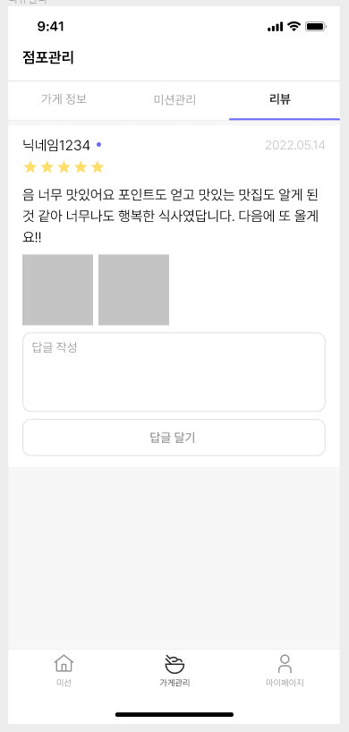
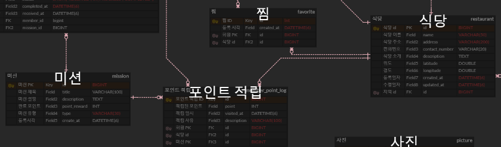
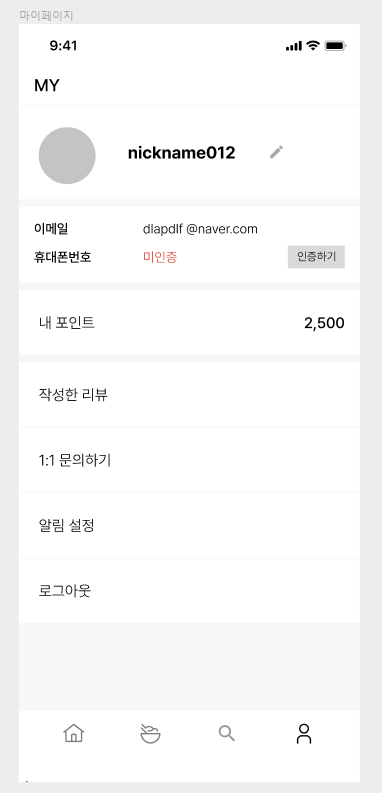

# Chapter 2. 실전 SQL - 어떤 Query를 작성해야 할까? (페데리코)

## 📝 학습 목표

---

1. 1주차 때 예시를 기반으로 여러가지 요구 사항에 대한 SQL 쿼리를 고민한다.
2. paging을 고려하여 쿼리를 작성한다.

# 🎯 핵심 키워드

---

<aside>
💡 주요 내용들에 대해 조사해보고, 자신만의 생각을 통해 정리해보세요!
레퍼런스를 참고하여 정의, 속성, 장단점 등을 적어주셔도 됩니다.
조사는 공식 홈페이지 **Best**, 블로그(최신 날짜) **Not Bad**

</aside>

이번 주차는 키워드가 딱히 없습니다!

원하실 경우 join연산에 대해 더 알아보는 정도면 될 것 같습니다.

## 📢 학습 후기

---

- 이번 주차 워크북을 해결해보면서 어땠는지 회고해봅시다.
- 핵심 키워드에 대해 완벽하게 이해했는지? 혹시 이해가 안 되는 부분은 뭐였는지?

<aside>
💡

## OFFSET 기반 페이징

**OFFSET 페이징 기법**은 (Sql문 기준) 쿼리문이 이렇게 실행이 됨.

```sql
SELECT * FROM posts
ORDER BY created_at DESC
LIMIT 10 OFFSET 10000;
```

위 코드는 10,001번째부터 10개를 가져오겠다는 뜻임.
근데 DB는 단순히 10000개를 스킵하는 게 아니라

1. 정렬(ORDER BY created_at DESC)을 먼저 함
2. 그 다음, 그 결과 중에서 앞의 10000개를 쭉 읽고 버림
3. 그리고 그 다음 10개를 리턴

→ 따라서 OFFSET 숫자가 커질수록 (뒤쪽의 데이터를 가져올수록) 성능이 느려짐. 앞에 있는데이터를 다 읽고 버려야 하기 때문.

+ 또, **OFFSET Paging** 방식의 가장 큰 단점은 데이터가 중간에 삽입되면 문제가 발생할 수 있음. (OFFSET은 고정된 위치 기준으로 잘라냄. 그래서, 데이터가 추가되면 모든 기준 위치가 흔들려버림)

추가적으로, **OFFSET Paging** 기법은 **Spring Data JPA**에서 제공하는 인터페이스인 **Pageable**로 구현이 됨.

```java
@GetMapping("/posts")
public Page<Post> getPosts(@PageableDefault(size = 10, sort = "createdAt", direction = DESC) Pageable pageable) {
    return postRepository.findAll(pageable);
}
```

**OFFSET Paging 방식 예시 코드**

```sql
select * from book as b
join (select count(*) as like_count
				 from book_likes 
					group by book_id) as likes on b.id = likes.book_id
order by likes.like_count desc
limit 15 offset (n - 1) * 15;

// n 은 실제 숫자가 들어와야함.
```

하지만, 목록 조회 시에 데이터가 갑자기 추가되면 페이징 시에 중복된 데이터가 발생할 수 있음. 그래서 사용되어야 하는 것이 **CURSOR 기반 페이징**임.

## CURSOR 기반 페이징

**데이터를 어디까지 봤는지**를 기준으로 다음 데이터를 가져오는 방식

CURSOR 기반 페이징 예시 (인기순 쿼리 CURSOR 기반 페이징)

```sql
SELECT * 
FROM book AS b // book 에 b 별칭
JOIN (		 // b와 서브쿼리문을 join (inner join) .. 어떤 join 인지 생략되어 있으면 inner join
    SELECT COUNT(*) AS like_count
    FROM book_likes 
    GROUP BY book_id
) AS likes ON b.id = likes.book_id    // inner join이므로 어떤 조건으로 두 테이블을 연결할건지 정하기 위해 쓰임 (on, using 으로 사용).. 여기선 book_id 로 사용됨.
WHERE likes.like_count < (
    SELECT COUNT(*) 
    FROM book_likes 
    WHERE book_id = 3
)  // book_id 가 3인것의 like 총합보다 작은 것들
ORDER BY likes.like_count DESC 
LIMIT 15;

```

이렇게 구현하면 됨. 하지만, 좋아요와 같은 **같은 수가 발생할 수 있는 수**는 정렬기준이 하나가 더 필요함. (복합키를 필요로함.)

예시)

```sql
SELECT b.*,
       CONCAT(LPAD(likes.like_count, 10, '0'), LPAD(b.id, 10, '0')) AS cursor_value 
FROM book AS b
JOIN (SELECT book_id, COUNT(*) AS like_count
      FROM book_likes
      GROUP BY book_id) AS likes ON b.id = likes.book_id
HAVING cursor_value < (SELECT CONCAT(LPAD(like_count_sub.like_count, 10, '0'), LPAD(like_count_sub.book_id, 10, '0'))
                FROM (SELECT book_id, COUNT(*) AS like_count
                      FROM book_likes
                      GROUP BY book_id) AS like_count_sub
                WHERE like_count_sub.book_id = 3) # 여기에 cursor_value 값이 들어가면 됨.
ORDER BY likes.like_count DESC, b.id DESC
LIMIT 15;

---

LPAD(likes.like_count, 10, '0') → 좋아요 수를 10자리 문자열로 만들고 앞에 0을 채움.

LPAD(b.id, 10, '0') → 책 ID도 10자리 문자열로 만들고 앞에 0을 채움.

CONCAT(...) → 두 문자열을 붙여서 하나의 문자열로 만듦.

JOIN () -> 조인 조건.

having -> 그룹 함수결과 조건으로 사용할 때 사용.

-> like_count_sub 테이블에서 book_id 가 3인 것들의 cursor_value 보다 작은 것들만 가져와라.
(비교할 때의 cursor_value는 like_count 가 앞의 10자리 + book_id가 뒤의 10자리임. 따라서, like_count가 작은것을 가져오게 됨.)

ORDER BY -> 필터링 된 것들 중에서 like_count 내림차순으로 정렬 만약 같으면 id로 내림차순

->좋아요 수가 같을경우 book_id로도 추가적으로 정렬하기위해서 cursor_value를 저렇게 만드는 것임.
```

`cursor_value = CONCAT(LPAD(like_count, 10, '0'), LPAD(id, 10, '0'))`

정렬 기준을 하나의 문자열로 합쳐서 정확한 순서와 비교가 가능한 커서값으로 사용함.

</aside>

## ⚠️ 스터디 진행 방법

---

1. 스터디를 진행하기 전, 워크북 내용들을 모두 채우고 스터디에서는 서로 모르는 내용들을 공유해주세요.
2. 미션은 워크북 내용들을 모두 완료하고 나서 스터디 전/후로 진행해보세요.
3. 다음주 스터디를 진행하기 전, 지난주 미션을 서로 공유해서 상호 피드백을 진행하시면 됩니다.

## ✅ 실습 체크리스트

---

## ☑️ 실습 인증

---

## 🔥 미션

---

1. 1주차 때 설계한 데이터베이스를 토대로 아래의 화면에 대한 쿼리를 작성


내가 진행중, 진행 완료한 미션 모아서 보는 쿼리(페이징 포함)


리뷰 작성하는 쿼리,
* 사진의 경우는 일단 배제


홈 화면 쿼리
(현재 선택 된 지역에서 도전이 가능한 미션 목록, 페이징 포함)


마이 페이지 화면 쿼리

**< 시니어 미션 >**

[시니어 미션](https://www.notion.so/1beb57f4596b81c395a4fd96fd81a063?pvs=21)

## 💪 미션 기록 (여기에 해도 되고 위의 미션에서 각 페이지 밑에 간단하게 블록 만들어서 하셔도 됩니다!)

---

<aside>
🍀 미션 기록의 경우, 아래 미션 기록 토글 속에 작성하시거나, 페이지를 새로 생성하여 해당 페이지에 기록하여도 좋습니다!

하지만, 결과물만 올리는 것이 아닌, **중간 과정 모두 기록하셔야 한다는 점!** 잊지 말아주세요.

</aside>

- **미션 기록**
    - 1번 미션
        
        **1번 미션**
  
        
        내가 진행중, 진행 완료한 미션 모아서 보는 쿼리(페이징 포함)
        
        1. 복합키는 사용하지 않아도 될 것 같음. (중복될 만한 키가 없기에)
        2. 미션 PK 와 member_mission Pk를 조인
        3. where 절로 member_mission.memberId 와 member.Id를 같은 것만 나오게 조건
        4. 그리고 , member_mission.status 중에서 'IN_PROGRESS' ,'COMPLETED' 인 것만 나오게
        5. 어떤 컬럼이 출력되어야할지 고민함.
        미션 id(mission_id를 프론트단에서 노출하지 않더라도 백엔드에서 식별하거나 클릭 시 상세페이지 이동 등을 처리하려면 필요함.), 포인트, 미션 설명, 미션상태(성공, 진행 중), 미션 완료시각, (미션 제목, 미션 수락시각 .. 이건 필요시에 추가.)
        6. 완료 시각 순으로 정렬.
        
        → 초기에는 member테이블의 PK와 member_mission PK로  join하려했음. 근데, 이건 where문으로 이 두 개가 같을 때를 조건 걸어서 해결하는 것이 올바름.
        
```sql
SELECT
member_mission.id,
mission.point_reward,
mission.description,
member_mission.status,
member_mission.received_at
FROM member_mission
JOIN mission ON member_mission.mission_id = mission.id
WHERE member_mission.member_id = :memberId
AND member_mission.status IN ('IN_PROGRESS', 'COMPLETED')
ORDER BY member_mission.received_at DESC
LIMIT :limit OFFSET :offset;
```
        
**코드 설명**
        
`member_mission.member_id = :memberId` 
        
- `:memberId`는 **외부에서 들어오는 값**을 쿼리에 안전하게 주입하는 자리
- `@Param("memberId") Long memberId` 같은 방식으로 연결됨
        
(추가사항) 미션과 함께 보여주는 내용으로 식당 ID 가 필요함. (어떤 식당에서 어떻게 포인트가 적립되었는지를 추적하기 위해) .. 따라서, **수정 필요**
        
지금 위의 코드에서 left join 연산을 추가하면 됨.
        
**수정된 코드)**
        
```sql
SELECT
    member_mission.id,
    mission.point_reward,
    mission.description,
    member_mission.status,
    member_mission.received_at,
    restaurant.name
FROM member_mission
         JOIN mission ON member_mission.mission_id = mission.id
         LEFT JOIN member_point_log ON member_point_log.mission_id = mission.id
         LEFT JOIN restaurant ON member_point_log.restaurant_id = restaurant.id
WHERE member_mission.member_id = :memberId
  AND member_mission.status IN ('IN_PROGRESS', 'COMPLETED')
ORDER BY member_mission.received_at DESC
    LIMIT :limit OFFSET :offset;
```
  
- 2번 미션

- **2번 미션**
            


        

리뷰 작성하는 쿼리,
* 사진의 경우는 일단 배제
        
가게관리는 erd 수정필요 
        
1. 회원테이블의 역할 칼럼이 기존 `ENUM('USER','ADMIN')` 으로 되어 있었는데, `ENUM('USER','ADMIN','OWNER')`로 변경.
2. 가게테이블에 회원테이블의 member_id를 외래키로 주입.
3. 점주가 리뷰테이블에 답글을 달 수 있도록 답글테이블 따로 생성.
        
```sql
SELECT
    review.id AS review_id,
    member.nickname AS writer_nickname,
    review.score,
    review.content AS review_content,
    review.created_at,
    review_reply.content AS reply_content
FROM review
         JOIN restaurant ON review.restaurant_id = restaurant.id
         JOIN member ON review.member_id = member.id
         LEFT JOIN review_reply ON review_reply.review_id = review.id
WHERE restaurant.member_id = :ownerId
ORDER BY review.created_at DESC;
```
        
- 3번 미션 
        
- **erd 수정 필요**
            

            
수정 전 erd
            
- [x]  **미션과 식당이 매핑이 안되어있어서 미션과 식당 직접 매핑 필요 (mission_restaraunt 테이블로 중간 매핑)**
- [x]  **mission 테이블에 최소 결제금액 필드가 추가되어야 할 것 같음.**
(최소 결제 금액이 미션이 되므로..? )
- [x]  **미션 유효기간 컬럼이 추가 되어야함.**
(미션 등록시각 + 7일)
- [x]  **지역 정보와 멤버가 매핑 되어야함**.
        
- 상단 메뉴
        
```sql
SELECT
    r.name AS region_name,
    COUNT(mm.id) % 10 AS progress_count
FROM member m
    JOIN region r ON m.region_id = r.id
    LEFT JOIN member_mission mm ON mm.member_id = m.id AND mm.status = 'COMPLETED'
WHERE m.id = :memberId
GROUP BY r.name;
```
        
- 코드 설명
        
`COUNT(mm.id) % 10 AS progress_count` : 10개 단위로 완료한 미션마다 포인트가 있으므로 ..
         ( + 미션 10개 달성시 1000p 주려는 기능을 만드려면, 추가 테이블 필요 )
        
- 하단 메뉴
        
```sql
SELECT
    restaurant.name AS restaurant_name,
    food_category.name AS food_category,
    mission.minimum_amount AS minimum_amount,
    mission.point_reward AS point_reward,
    member_mission.status AS status,
    member_mission.received_at AS received_at,
    DATE_ADD(member_mission.received_at, INTERVAL mission.duration_days DAY) AS expires_at,
    DATEDIFF(DATE_ADD(member_mission.received_at, INTERVAL mission.duration_days DAY), NOW()) AS remaining_days
FROM member_mission
         JOIN mission ON member_mission.mission_id = mission.id
         JOIN mission_restaurant ON mission.id = mission_restaurant.mission_id
         JOIN restaurant ON mission_restaurant.restaurant_id = restaurant.id
         JOIN food_category ON restaurant.category_id = food_category.id
WHERE member_mission.member_id = :memberId
  AND member_mission.status IN ('RECEIVED', 'IN_PROGRESS')
ORDER BY member_mission.received_at DESC
    LIMIT :limit OFFSET :offset;

 ```
        
- 4번 미션
        
**마이 페이지 관리**

        
마이 페이지 화면 쿼리
        
1. 복합키 사용 필요 x 
2. 화면 단에서 필요한 정보들이 뭔지 파악
- 회원 닉네임, 회원 이메일, 회원 휴대폰 번호, 회원의 포인트, 회원이 작성한 리뷰
        
          
        
```sql
SELECT
    member.id,
    member.name,
    member.social_id,
    member.phone_number,
    (
        SELECT COALESCE(SUM(point), 0)
        FROM member_point_log
        WHERE member_point_log.member_id = member.id
    ) AS total_point,
    (
        SELECT COUNT(*)
        FROM review
        WHERE review.member_id = member.id
    ) AS review_count
FROM member
WHERE member.id = :memberId;
```
        
**코드 설명** 

`COALESCE(SUM(point), 0)` 
1. SUM(point) : 집계함수 point 의 sum 값

2. COALESCE(SUM(point), 0) : SUM(point)가 null 값이면 0. SUM(point)가 null 값이 아니면, SUM(point) 원래 있던 값이 값이  됨.

        
    

## ⚡ 트러블 슈팅

---

<aside>
💡 실습하면서 생긴 문제들에 대해서, **이슈 - 문제 - 해결** 순서로 작성해주세요.

</aside>

<aside>
💡 스스로 해결하기 어렵다면? 스터디원들에게 도움을 요청하거나 **너디너리의 지식IN 채널에 질문**해보세요!

</aside>

- ⚡이슈 작성 예시 (이슈가 생기면 아래를 복사해서 No.1, No.2, No3 … 으로 작성해서 트러블 슈팅을 꼭 해보세요!)
    
    **`이슈`**
    
    👉 앱 실행 중에 노래 다음 버튼을 누르니까 앱이 종료되었다.
    
    **`문제`**
    
    👉 노래클래스의 데이터리스트의 Size를 넘어서 NullPointException이 발생하여 앱이 종료된 것이었다. 
    
    **`해결`**
    
    👉  노래 다음 버튼을 눌렀을 때 데이터리스트의 Size를 검사해 Size보다 넘어가려고 하면 다음으로 넘어가는 메서드를 실행시키지 않고, 첫 노래로 돌아가게끔 해결
    
    **`참고레퍼런스`**
    
    - 링크
- ⚡이슈 No.1
    
    **`이슈`**
    
    👉 [트러블이 생긴 상태 작성]
    
    **`문제`**
    
    👉 [어떤 이유로 해당 이슈가 일어났는지 작성]
    
    **`해결`**
    
    👉  [해결 방법 작성]
    
    **`참고레퍼런스`**
    
    - [문제 해결 시 참고한 링크]

## 🤔 참고 자료

[2주차](2%E1%84%8C%E1%85%AE%E1%84%8E%E1%85%A1%201beb57f4596b81198554c7e72b7c8881.csv)

---

Copyright © 2023 최용욱(똘이) All rights reserved.

Copyright © 2024, 2025 제이미(김준환) All rights reserved.