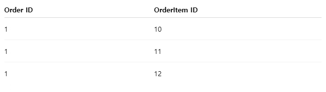

# Chapter 5. JPA 기초 및 프로젝트 구조 (페데리코)

# 📝 학습 목표

---

1. JPA의 개념, 필요성에 대해 이해한다.
2. Spring data JPA를 이용하여 Entity 설계, 매핑을 한다.


# 🎯 핵심 키워드

---

<aside>
💡 주요 내용들에 대해 조사해보고, 자신만의 생각을 통해 정리해보세요!
레퍼런스를 참고하여 정의, 속성, 장단점 등을 적어주셔도 됩니다.
조사는 공식 홈페이지 **Best**, 블로그(최신 날짜) **Not Bad**

</aside>

- Domain
    
    도메인은 일반적으로 비즈니스 로직과 관련된 핵심 객체들을 의미함. Spring, JPA 에서는 보통 `@Entity` 클래스를 포함해서 도메인 계층이라고 부름. 도메인은 DB나 외부 시스템과 분리된 순수한 비즈니스 개념을 담아야함.
    
- 양방향 매핑
    
    객체는 참조용 필드가 있는 객체만 다른 객체를 참조하는 것이 가능하다. 그렇기에 두 객체 사이에 하나의 객체만 참조용 필드를 갖고 참조하면 단방향 관계, 두 객체 모두가 각각 참조용 필드를 갖고 참조하면 양방향 관계라고 한다. 
    
    단방향 매핑은 연관관계의 주인 (외래키를 갖고 있는 엔터티) 에 연관관계를 주입하는 것이고, **양방향 매핑은 연관관계 주인이 아닌 엔터티에게도 연관관계를 주입하는 것이다.** 
    
    양방향 매핑의 장점은 객체 그래프 탐색으로 인한 이점이 있고, cascade의 설정이 가능하다는 점이다. 
    
    ( cascade란? 연관관계의 주인인 테이블에 설정을 해서 참조 대상인 테이블의 칼럼이 삭제 될 때 같이 삭제되거나 변경이 될 때 같이 변경이 되는 기능)
    
    또한, 양방향 매핑을 설정해두면 한 쪽에서만 참조하는 게 아니라, 반대편에서도 연관된 객체에 접근할 수 있게 된다. 따라서, 복잡한 JOIN 쿼리 없이도 객체 간 탐색만으로 원하는 데이터 꺼낼 수 있게 된다.
    
- N + 1 문제
    
    한 번의 전체 조회 쿼리로 N개의 데이터를 가져온 뒤, 그 N개의 각각에 대해 추가쿼리(N번)가 실행되는 문제이다. 이는 결국 불필요한 쿼리, 불필요한 네트워크 트래픽, 느려지는 성능으로 이어짐.
    
    @ManyToOne 연관관계를 가진 엔터티에서 주로 발생한다.
    
    1. 즉시 로딩 (EAGER)
    
    ```java
    @ManyToOne(fetch = FetchType.EAGER)
    private Member member;
    ```
    
    엔티티 조회 시 연관관계에 있는 데이터까지 한번에 조회해오는 기능이다. N + 1 문제는 발생하지 않지만, 원하지 않는 데이터까지 무조건 가져오므로 **성능 이슈** 또는 **쿼리 과잉**이 생길 수 있음.
    
    1. 지연 로딩 (LAZY)
    
    ```java
    @ManyToOne(fetch = FetchType.LAZY)
    private Member member;
    ```
    
    엔티티 조회 시점이 아닌 엔티티 내 연관관계를 참조할 때 연관된 데이터를 조회하는 기능이다. 
    
    해결 방법
    
    1. Fetch Join
        
        : DB에서 데이터를 가져올 때 처음부터 연관된 엔터티나 컬렉션을 한번에 같이 조회하는 방법. 
        
        예시)
        
        ```java
        @Query("SELECT o FROM Order o JOIN FETCH o.orderItems")
        List<Order> findAllWithItems();
        ```
        
        
        
        `@Query("SELECT o FROM Order o JOIN FETCH o.orderItems")` 를 실행하면, Order ID 는 중복되지만, JPA는 중복을 무시하고 하나만 유지함. 이게 가능한 이유가 `영속성 컨텍스트` 가 같은 ID를 가진 엔터티는 1개만 관리하기 때문이다. 
        
        **또한, JPA에서 Fetch Join과 Pageable은 같이 쓰면 정상적으로 작동하지 않는다.** 이유는
        
        **DB에서 제대로 된 페이징이 적용되지 않고, 메모리에서 잘못된 페이징 결과**를 만들 수 있기 때문.
        
        그래서 Fetch Join을 하게 되면 Batch SIze 방식으로 페이징 목록을 만들어야함.
        
    2. EntityGraph 사용
        
        지연로딩되어 있는 연관 데이터를 JPQL을 직접 작성하지 않고 어노테이션 기반으로 Fetch Join을 설정할 수 있게 도와주는 기능
        
        예시)
        
        ```java
        @Entity
        public class Order {
            @Id
            private Long id;
        
            @ManyToOne(fetch = FetchType.LAZY)
            private Member member;
        }
        ```
        
        ```java
        public interface OrderRepository extends JpaRepository<Order, Long> {
        
            @EntityGraph(attributePaths = {"member"})
            List<Order> findAll(); // member를 Fetch Join으로 자동 조회
        }
        ```
        
        메서드에 `@EntityGraph` 붙이면 됨.
        
        `SELECT o FROM Order o JOIN FETCH o.member` 와 동일한 효과
        
    3. 배치 크기 설정
        
        : 지연로딩(LAZY)로 설정된 연관 엔터티들을 한 번에 모아서 쿼리 한방에 가져오도록 JPA가 자동으로 처리하는 기능
        
        예시)
        
        ```yaml
        spring:
          jpa:
            properties:
              hibernate.default_batch_fetch_size: 100
        ```
        
        ```java
        @OneToMany(fetch = FetchType.LAZY)
        @BatchSize(size = 100)
        private List<OrderItem> orderItems;
        ```
        

# 📢 학습 후기

---

- 이번 주차 워크북을 해결해보면서 어땠는지 회고해봅시다.
- 핵심 키워드에 대해 완벽하게 이해했는지? 혹시 이해가 안 되는 부분은 뭐였는지?

<aside>
💡

</aside>

# ⚠️ 스터디 진행 방법

---

1. 스터디를 진행하기 전, 워크북 내용들을 모두 채우고 스터디에서는 서로 모르는 내용들을 공유해주세요.
2. 미션은 워크북 내용들을 모두 완료하고 나서 스터디 전/후로 진행해보세요.
3. 다음주 스터디를 진행하기 전, 지난주 미션을 서로 공유해서 상호 피드백을 진행하시면 됩니다.

# 🔥 미션

---

워크북을 따라해보고

1. 본인이 만들었던 ERD에 해당하는 테이블들에 대한 엔티티를 만들고
2. 워크북에서 다루지 않은 연관관계 매핑(양방향 포함)을 다 적용하고
3. 엔티티의 칼럼에 대한 세부적인 설정을 모두 하여
4. 로컬 디비에 실제로 테이블이 생긴 것을 캡쳐할 것(by datagrip)
5. 이후 본인의 깃허브 리포지토리를 만들어 mission5 브랜치에 올린 후,
**해당 깃허브 링크를 본인 워크북에 포함해오기. (미션 기록란에 링크 제출)**
    
    **❗main 브랜치에 올리지 말 것!** (브랜치 명이 굳이 mission5 이 아니어도 됨!) **❗**
    

[시니어 미션](https://www.notion.so/1e2b57f4596b81e9a0c1f401cbb5d69f?pvs=21)

<aside>
📌 **주의 사항**

결과물만 올리면 안되고, 중간 과정 또한 기록을 남겨주셔야 합니다.
(DB 연결, 테이블 생성 등)

**결과물과 중간 과정 모두 기록하여 제출**하라는 뜻입니다!

</aside>

# 💪 미션 기록

---

<aside>
🍀 미션 기록의 경우, 아래 미션 기록 토글 속에 작성하시거나, 페이지를 새로 생성하여 해당 페이지에 기록하여도 좋습니다!

하지만, 결과물만 올리는 것이 아닌, **중간 과정 모두 기록하셔야 한다는 점!** 잊지 말아주세요.

</aside>

- **미션 기록**
    
    
    

> **github 링크**
> 
> 
> 
> https://github.com/SKU-UMC-8th-SpringBoot/Federico-Workbook
> 

# ⚡ 트러블 슈팅

---

<aside>
💡 실습하면서 생긴 문제들에 대해서, **이슈 - 문제 - 해결** 순서로 작성해주세요.

</aside>

<aside>
💡 스스로 해결하기 어렵다면? 스터디원들에게 도움을 요청하거나 **너디너리의 지식IN 채널에 질문**해보세요!

</aside>

- ⚡이슈 작성 예시 (이슈가 생기면 아래를 복사해서 No.1, No.2, No3 … 으로 작성해서 트러블 슈팅을 꼭 해보세요!)
    
    **`이슈`**
    
    👉 앱 실행 중에 노래 다음 버튼을 누르니까 앱이 종료되었다.
    
    **`문제`**
    
    👉 노래클래스의 데이터리스트의 Size를 넘어서 NullPointException이 발생하여 앱이 종료된 것이었다. 
    
    **`해결`**
    
    👉  노래 다음 버튼을 눌렀을 때 데이터리스트의 Size를 검사해 Size보다 넘어가려고 하면 다음으로 넘어가는 메서드를 실행시키지 않고, 첫 노래로 돌아가게끔 해결
    
    **`참고레퍼런스`**
    
    - 링크
- ⚡이슈 No.1

---

Copyright © 2023 최용욱(똘이) All rights reserved.

Copyright © 2024 신수정(베뉴) All rights reserved.