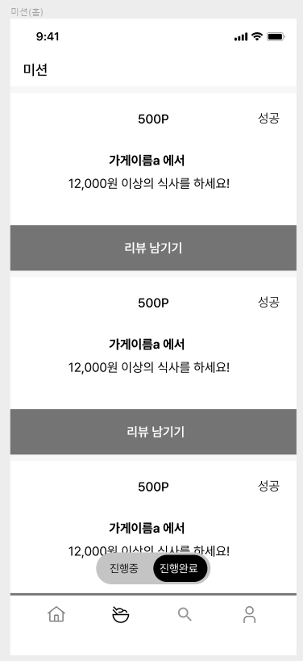

# Chapter 6. JPA 활용
# 📝 학습 목표

---

1. 즉시 로딩과 지연 로딩의 전략 차이에 대해 알아보고, 지연 로딩을 채택하는 이유에 대해 이해한다.
2. JPQL과 QueryDSL의 차이에 대해 이해한다.
## 🎯핵심 키워드

---

<aside>
💡 주요 내용들에 대해 조사해보고, 자신만의 생각을 통해 정리해보세요!
레퍼런스를 참고하여 정의, 속성, 장단점 등을 적어주셔도 됩니다.
조사는 공식 홈페이지 **Best**, 블로그(최신 날짜) **Not Bad**

</aside>

- **지연로딩과 즉시로딩의 차이**
    
    **지연로딩 (Lazy)** 
    
    - 연관된 엔티티를 실제로 사용할 때 SQL을 날려서 불러옴. (프록시 객체로 대기)
    - 객체를 사용하는 시점에 로딩을 해주는 방법
    - N+1 문제가 발생하지 않는 것은 아님.
    
    **즉시로딩 (Eager)**
    
    - **실무에서 쓰면 안됨.**
    - Jpql로 전달되는 과정에서 Jpql 후 Eager 감지로 인한 N 쿼리가 추가로 발생하는 경우가 있기 때문에 사용해서는 안됨.
- **Fetch Join**
    - 지연 로딩 상태인 엔티티를 한 번의 쿼리로 **연관 엔티티까지 조회**하는 JPQL 문법
    - N + 1 문제 해결에 유용함.
    - 단점으로 페이징쿼리가 불가능하거나 성능이 저하됨.
    
    ```java
    @Query("SELECT o FROM Order o JOIN FETCH o.orderItems")
    List<Order> findAllWithItems();
    ```
    
    `@Query("SELECT o FROM Order o JOIN FETCH o.orderItems")` 를 실행하면, Order ID 는 중복되지만, JPA는 중복을 무시하고 하나만 유지함. 이게 가능한 이유가 `영속성 컨텍스트` 가 같은 ID를 가진 엔터티는 1개만 관리하기 때문이다. 
    
    .png)
    
    **또한, JPA에서 Fetch Join과 Pageable은 같이 쓰면 정상적으로 작동하지 않는다.** 이유는
    
    **DB에서 제대로 된 페이징이 적용되지 않고, 메모리에서 잘못된 페이징 결과**를 만들 수 있기 때문.
    
    그래서 Fetch Join을 하게 되면 Batch SIze 방식으로 페이징 목록을 만들어야함.
    
- **@EntityGraph**
    
    지연로딩되어 있는 연관 데이터를 JPQL을 직접 작성하지 않고 어노테이션 기반으로 Fetch Join을 설정할 수 있게 도와주는 기능
    
    예시)
    
    ```java
    @Entity
    public class Order {
        @Id
        private Long id;
    
        @ManyToOne(fetch = FetchType.LAZY)
        private Member member;
    }
    ```
    
    ```java
    public interface OrderRepository extends JpaRepository<Order, Long> {
    
        @EntityGraph(attributePaths = {"member"})
        List<Order> findAll(); // member를 Fetch Join으로 자동 조회
    }
    ```
    
    메서드에 `@EntityGraph` 붙이면 됨.
    
    `SELECT o FROM Order o JOIN FETCH o.member` 와 동일한 효과
    
- **JPQL**
    - 엔티티 기반으로 작성된 JPA 전용 쿼리 언어
    - RDB 테이블이 아닌 엔티티 필드 기준으로 작성
    
    ```java
    @Query("SELECT m FROM Member m WHERE m.name = :name")
    Member findByName(@Param("name") String name);
    ```
    
- **QueryDSL**
    - JPQL은 문자열이기에 JPQL문법이 틀려도 개발자가 알아차리기가 힘들고, 문자열과 문자열 사이에 if-else 문이나 for 문 같은 코드가 들어가서 가독성을 떨어트림. 이걸 해결하기 위해 사용함.
    - 타입 안전성을 보장하는 자바 기반의 쿼리 빌더 라이브러리
    - QueryDSL은 QueryDSL은 코드 기반의 쿼리 빌더를 제공하기 때문에, 컴파일 시점에 쿼리의 오류를 잡을 수 있으며 동적 쿼리 작성이 편리하고, 메서드 체이닝을 통한 복잡한 쿼리 작성에 유리
    
    1. build.gradle에 QueryDSL을 위한 플러그인 및 종속성 설치를하면 자동으로 엔티티마다 Q 클래스가 자동으로 생성됨.
    2. 해당 Q 클래스를 사용하여, QueryDSL로 쿼리를 작성함.
    
    예시)
    
    ```java
    QStore store = QStore.store;
    
    List<Store> result = queryFactory
        .selectFrom(store)
        .where(store.name.eq("요아정"))
        .fetch();
    ```
    
    ```java
    QStore store = QStore.store;
    QRegion region = QRegion.region;
    
    List<Store> result = queryFactory
        .selectFrom(store)
        .join(store.region, region)
        .where(
            region.name.eq("서울"),               // 지역이 서울
            store.name.contains("요아정"),        // 이름에 '요아정' 포함
            store.score.goe(4.0)                 // 점수 4.0 이상
        )
        .orderBy(store.score.desc()) // 점수 높은 순 정렬
        .fetch();
    ```
    

## 📢 학습 후기

---

- 이번 주차 워크북을 해결해보면서 어땠는지 회고해봅시다.
- 핵심 키워드에 대해 완벽하게 이해했는지? 혹시 이해가 안 되는 부분은 뭐였는지?

<aside>
💡 즉시 로딩은 애초에 모든 걸 가져오니 항상 N+1 문제가 생기고, 지연 로딩 + fetch join을 조합해서 필요한 경우에만 즉시로딩처럼 만드는 게 더 유연하다.

@EntityGraph는  FetchJoin의 기능을 메서드에 어노테이션을 붙여서 대신 사용하는 것이다. 이렇게하면 한 번 정의해서 재사용이 가능함.

</aside>

## ⚠️ 스터디 진행 방법

---

1. 스터디를 진행하기 전, 워크북 내용들을 모두 채우고 스터디에서는 서로 모르는 내용들을 공유해주세요.
2. 미션은 워크북 내용들을 모두 완료하고 나서 스터디 전/후로 진행해보세요.
3. 다음주 스터디를 진행하기 전, 지난주 미션을 서로 공유해서 상호 피드백을 진행하시면 됩니다.

## ✅ 실습 체크리스트

---

## ☑️ 실습 인증

---

`feature/week6` 브랜치를 판 후 실습 코드를 전부 첨부하여 진행해주세요. 

깃 링크 : https://github.com/SKU-UMC-8th-SpringBoot/Federico-Workbook/tree/main/week6

## 🔥 미션

---

1. N+1 문제를 해결할 수 있는 여러 가지 다른 방법들에 대해 조사한 후, [ 핵심 키워드 ] 에 정리
2. 2주차 미션 때 했던 해당 화면들에 대해 작성했던 쿼리를 QueryDSL로 작성하여 리팩토링하기
- 진행중, 진행 완료한 미션
    
    
    
    내가 진행중, 진행 완료한 미션 모아서 보는 쿼리(페이징 포함)
    
    기존 코드
    
    ```sql
    SELECT
        member_mission.id,
        mission.point_reward,
        mission.description,
        member_mission.status,
        member_mission.received_at,
        restaurant.name
    FROM member_mission
    JOIN mission ON member_mission.mission_id = mission.id
    LEFT JOIN member_point_log ON member_point_log.mission_id = mission.id
    LEFT JOIN restaurant ON member_point_log.restaurant_id = restaurant.id
    WHERE member_mission.member_id = :memberId
      AND member_mission.status IN ('IN_PROGRESS', 'COMPLETED')
    ORDER BY member_mission.received_at DESC
    LIMIT :limit OFFSET :offset;
    ```
    
    ```java
    public List<MemberMissionDto> findMemberMissions(Long memberId, int limit, int offset) {
        // Q클래스: 각 엔티티에 대해 QueryDSL이 자동 생성한 클래스 (Q + 엔티티명)
        QMemberMission memberMission = QMemberMission.memberMission;
        QMission mission = QMission.mission;
    
        return queryFactory
            // SELECT 절: 원하는 필드들을 DTO 생성자에 맞춰 선택
            // Projections.constructor(): 지정된 생성자에 매핑되도록 SELECT 필드를 전달
            .select(Projections.constructor(MemberMissionDto.class,
                memberMission.id,               // member_mission.id
                mission.pointReward,            // mission.point_reward
                mission.description,            // mission.description
                memberMission.status,           // member_mission.status
                memberMission.receivedAt        // member_mission.received_at
            ))
    
            // FROM 절: memberMission 테이블을 기준으로 조회
            .from(memberMission)
    
            // JOIN 절: member_mission.mission_id = mission.id 에 해당하는 inner join
            .join(memberMission.mission, mission)
    
            // WHERE 절: memberId 조건과 상태 필터링
            .where(
                memberMission.member.id.eq(memberId), // member_id = :memberId
                memberMission.status.in(              // status IN ('IN_PROGRESS', 'COMPLETED')
                    MissionStatus.IN_PROGRESS, MissionStatus.COMPLETED
                )
            )
    
            // ORDER BY 절: received_at 내림차순 정렬
            .orderBy(memberMission.receivedAt.desc())
    
            // OFFSET: 몇 번째 행부터 시작할지 지정 (페이징)
            .offset(offset)
    
            // LIMIT: 몇 개의 행을 가져올지 제한
            .limit(limit)
    
            // 실행하고 결과 리스트로 반환
            .fetch();
    }
    
    ```
    
- 리뷰 작성하는 쿼리
    
    
    
    리뷰 작성하는 쿼리,
    * 사진의 경우는 일단 배제
    
    ```sql
    SELECT
        review.id AS review_id,
        member.nickname AS writer_nickname,
        review.score,
        review.content AS review_content,
        review.created_at,
        review_reply.content AS reply_content
    FROM review
    JOIN restaurant ON review.restaurant_id = restaurant.id
    JOIN member ON review.member_id = member.id
    LEFT JOIN review_reply ON review_reply.review_id = review.id
    WHERE restaurant.member_id = :ownerId
    ORDER BY review.created_at DESC;
    ```
    
    ```java
    public List<OwnerReviewDto> findReviewsByRestaurantOwner(Long ownerId) {
        QReview review = QReview.review;
        QRestaurant restaurant = QRestaurant.restaurant;
        QMember member = QMember.member;
        QReviewReply reviewReply = QReviewReply.reviewReply;
    
        return queryFactory
            // SELECT 절: OwnerReviewDto 생성자에 맞춰 필요한 필드들만 지정
            .select(Projections.constructor(OwnerReviewDto.class,
                review.id,                 // review.id AS review_id
                member.nickname,          // member.nickname AS writer_nickname
                review.score,             // review.score
                review.content,           // review.content AS review_content
                review.createdAt,         // review.created_at
                reviewReply.content       // review_reply.content AS reply_content
            ))
    
            // FROM review 테이블 기준
            .from(review)
    
            // INNER JOIN: review.restaurant_id = restaurant.id
            .join(review.restaurant, restaurant)
    
            // INNER JOIN: review.member_id = member.id
            .join(review.member, member)
    
            // LEFT JOIN: review_reply.review_id = review.id
            .leftJoin(reviewReply)
            .on(reviewReply.review.id.eq(review.id))
    
            // WHERE: restaurant.owner_id = :ownerId
            .where(restaurant.member.id.eq(ownerId))
    
            // 정렬: 작성일 내림차순
            .orderBy(review.createdAt.desc())
    
            // 실행
            .fetch();
    }
    
    ```
    
- 홈 화면 쿼리
    
    
    
    홈 화면 쿼리
    (현재 선택 된 지역에서 도전이 가능한 미션 목록, 페이징 포함)
    
    상단 메뉴 (기존 코드)
    
    ```sql
    SELECT 
        r.name AS region_name,
        COUNT(mm.id) % 10 AS progress_count
    FROM member m
    JOIN region r ON m.region_id = r.id
    LEFT JOIN member_mission mm ON mm.member_id = m.id AND mm.status = 'COMPLETED'
    WHERE m.id = :memberId
    GROUP BY r.name;
    ```
    
    하단 메뉴 (기존 코드)
    
    ```sql
    SELECT
        restaurant.name AS restaurant_name,
        food_category.name AS food_category,
        mission.minimum_amount AS minimum_amount,
        mission.point_reward AS point_reward,
        member_mission.status AS status,
        member_mission.received_at AS received_at,
        DATE_ADD(member_mission.received_at, INTERVAL mission.duration_days DAY) AS expires_at,
        DATEDIFF(DATE_ADD(member_mission.received_at, INTERVAL mission.duration_days DAY), NOW()) AS remaining_days
    FROM member_mission
    JOIN mission ON member_mission.mission_id = mission.id
    JOIN mission_restaurant ON mission.id = mission_restaurant.mission_id
    JOIN restaurant ON mission_restaurant.restaurant_id = restaurant.id
    JOIN food_category ON restaurant.category_id = food_category.id
    WHERE member_mission.member_id = :memberId
      AND member_mission.status IN ('RECEIVED', 'IN_PROGRESS')
    ORDER BY member_mission.received_at DESC
    LIMIT :limit OFFSET :offset;
    
    ```
    
    상단 메뉴 (리팩토링)
    
    ```java
    public List<RegionProgressDto> findRegionProgress(Long memberId) {
        QMember member = QMember.member;
        QRegion region = QRegion.region;
        QMemberMission memberMission = QMemberMission.memberMission;
    
        return queryFactory
            // SELECT 절: DTO 매핑 (지역명, 완료 미션 개수 % 10)
            .select(Projections.constructor(RegionProgressDto.class,
                region.name,                                  // r.name AS region_name
                memberMission.id.count().mod(10)              // COUNT(mm.id) % 10 AS progress_count
            ))
    
            // FROM member m
            .from(member)
    
            // JOIN region r ON m.region_id = r.id
            .join(member.region, region)
    
            // LEFT JOIN member_mission mm ON mm.member_id = m.id AND mm.status = 'COMPLETED'
            .leftJoin(memberMission)
            .on(
                memberMission.member.id.eq(member.id)
                .and(memberMission.status.eq(MissionStatus.COMPLETED)) // 상태 조건 포함
            )
    
            // WHERE m.id = :memberId
            .where(member.id.eq(memberId))
    
            // GROUP BY r.name
            .groupBy(region.name)
    
            // 실행
            .fetch();
    }
    
    ```
    
    하단 메뉴 (리팩토링)
    
    ```java
    public List<MemberMissionDetailDto> findDetailedMissions(Long memberId, int limit, int offset) {
        QMemberMission memberMission = QMemberMission.memberMission;
        QMission mission = QMission.mission;
        QMissionRestaurant missionRestaurant = QMissionRestaurant.missionRestaurant;
        QRestaurant restaurant = QRestaurant.restaurant;
        QFoodCategory foodCategory = QFoodCategory.foodCategory;
    
        return queryFactory
            .select(Projections.constructor(MemberMissionDetailDto.class,
                restaurant.name, // restaurant.name AS restaurant_name
                foodCategory.name, // food_category.name AS food_category
                mission.minimumAmount, // mission.minimum_amount
                mission.pointReward, // mission.point_reward
                memberMission.status, // member_mission.status
                memberMission.receivedAt, // member_mission.received_at
    
                // DATE_ADD(received_at, INTERVAL duration_days DAY) AS expires_at
                Expressions.dateTemplate(LocalDateTime.class,
                    "DATE_ADD({0}, INTERVAL {1} DAY)", memberMission.receivedAt, mission.durationDays),
    
                // DATEDIFF(DATE_ADD(received_at, INTERVAL duration_days DAY), NOW()) AS remaining_days
                Expressions.numberTemplate(Integer.class,
                    "DATEDIFF(DATE_ADD({0}, INTERVAL {1} DAY), NOW())", memberMission.receivedAt, mission.durationDays)
            ))
    
            .from(memberMission)
    
            // JOIN mission
            .join(memberMission.mission, mission)
    
            // JOIN mission_restaurant
            .join(missionRestaurant).on(missionRestaurant.mission.id.eq(mission.id))
    
            // JOIN restaurant
            .join(missionRestaurant.restaurant, restaurant)
    
            // JOIN food_category
            .join(restaurant.category, foodCategory)
    
            // WHERE memberId와 상태 필터링
            .where(
                memberMission.member.id.eq(memberId),
                memberMission.status.in(MissionStatus.RECEIVED, MissionStatus.IN_PROGRESS)
            )
    
            // 정렬 및 페이징
            .orderBy(memberMission.receivedAt.desc())
            .offset(offset)
            .limit(limit)
    
            .fetch();
    }
    
    ```
    
- 마이 페이지 화면 쿼리
    
    
    
    마이 페이지 화면 쿼리
    
    기존 코드
    
    ```sql
    SELECT
        member.id,
        member.name,
        member.social_id,
        member.phone_number,
        (
            SELECT COALESCE(SUM(point), 0)
            FROM member_point_log
            WHERE member_point_log.member_id = member.id
        ) AS total_point,
        (
            SELECT COUNT(*)
            FROM review
            WHERE review.member_id = member.id
        ) AS review_count
    FROM member
    WHERE member.id = :memberId;
    ```
    
    리팩토링
    
    ```java
    public MemberSummaryDto findMemberSummary(Long memberId) {
        QMember member = QMember.member;
        QMemberPointLog memberPointLog = QMemberPointLog.memberPointLog;
        QReview review = QReview.review;
    
        return queryFactory
            .select(Projections.constructor(MemberSummaryDto.class,
                member.id,                 // member.id
                member.name,               // member.name
                member.socialId,           // member.social_id
                member.phoneNumber,        // member.phone_number
    
                // (SELECT COALESCE(SUM(point), 0) FROM member_point_log WHERE member_id = member.id)
                JPAExpressions.select(memberPointLog.point.sum().coalesce(0))
                    .from(memberPointLog)
                    .where(memberPointLog.member.id.eq(member.id)),
    
                // (SELECT COUNT(*) FROM review WHERE review.member_id = member.id)
                JPAExpressions.select(review.count())
                    .from(review)
                    .where(review.member.id.eq(member.id))
            ))
            .from(member)
            .where(member.id.eq(memberId))
            .fetchOne();
    }
    
    ```
    

# 💪 미션 기록

---

<aside>
🍀 미션 기록의 경우, 아래 미션 기록 토글 속에 작성하시거나, 페이지를 새로 생성하여 해당 페이지에 기록하여도 좋습니다!

하지만, 결과물만 올리는 것이 아닌, **중간 과정 모두 기록하셔야 한다는 점!** 잊지 말아주세요.

</aside>

- **미션 기록**

[시니어 미션](https://www.notion.so/1e2b57f4596b81c1b23dea2235076b2c?pvs=21)

## ⚡ 트러블 슈팅

---

<aside>
💡 실습하면서 생긴 문제들에 대해서, **이슈 - 문제 - 해결** 순서로 작성해주세요.

</aside>

<aside>
💡 스스로 해결하기 어렵다면? 스터디원들에게 도움을 요청하거나 **너디너리의 지식IN 채널에 질문**해보세요!

</aside>

- ⚡이슈 작성 예시 (이슈가 생기면 아래를 복사해서 No.1, No.2, No3 … 으로 작성해서 트러블 슈팅을 꼭 해보세요!)
    
    **`이슈`**
    
    👉 앱 실행 중에 노래 다음 버튼을 누르니까 앱이 종료되었다.
    
    **`문제`**
    
    👉 노래클래스의 데이터리스트의 Size를 넘어서 NullPointException이 발생하여 앱이 종료된 것이었다. 
    
    **`해결`**
    
    👉  노래 다음 버튼을 눌렀을 때 데이터리스트의 Size를 검사해 Size보다 넘어가려고 하면 다음으로 넘어가는 메서드를 실행시키지 않고, 첫 노래로 돌아가게끔 해결
    
    **`참고레퍼런스`**
    
    - 링크
- ⚡이슈 No.1
    
    **`이슈`**
    
    👉 [트러블이 생긴 상태 작성]
    
    **`문제`**
    
    👉 [어떤 이유로 해당 이슈가 일어났는지 작성]
    
    **`해결`**
    
    👉  [해결 방법 작성]
    
    **`참고레퍼런스`**
    
    - [문제 해결 시 참고한 링크]

## 🤔 참고 자료

---

Copyright © 2025 신수정(베뉴) All rights reserved.

public List<MemberMissionDto> findMemberMissions(Long memberId, int limit, int offset) {
// Q클래스: 각 엔티티에 대해 QueryDSL이 자동 생성한 클래스 (Q + 엔티티명)
QMemberMission memberMission = QMemberMission.memberMission;
QMission mission = QMission.mission;

```
return queryFactory
    // SELECT 절: 원하는 필드들을 DTO 생성자에 맞춰 선택
    // Projections.constructor(): 지정된 생성자에 매핑되도록 SELECT 필드를 전달
    .select(Projections.constructor(MemberMissionDto.class,
        memberMission.id,               // member_mission.id
        mission.pointReward,            // mission.point_reward
        mission.description,            // mission.description
        memberMission.status,           // member_mission.status
        memberMission.receivedAt        // member_mission.received_at
    ))

    // FROM 절: memberMission 테이블을 기준으로 조회
    .from(memberMission)

    // JOIN 절: member_mission.mission_id = mission.id 에 해당하는 inner join
    .join(memberMission.mission, mission)

    // WHERE 절: memberId 조건과 상태 필터링
    .where(
        memberMission.member.id.eq(memberId), // member_id = :memberId
        memberMission.status.in(              // status IN ('IN_PROGRESS', 'COMPLETED')
            MissionStatus.IN_PROGRESS, MissionStatus.COMPLETED
        )
    )

    // ORDER BY 절: received_at 내림차순 정렬
    .orderBy(memberMission.receivedAt.desc())

    // OFFSET: 몇 번째 행부터 시작할지 지정 (페이징)
    .offset(offset)

    // LIMIT: 몇 개의 행을 가져올지 제한
    .limit(limit)

    // 실행하고 결과 리스트로 반환
    .fetch();

```

}